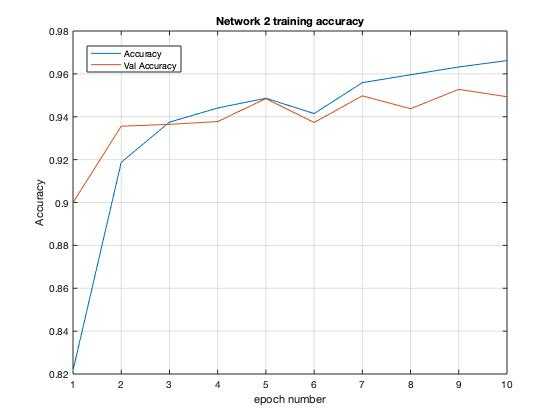

# Gender classification

The project deal with the training and a preliminary test of a Convolutional Neural Network devoted to
the classification of the gender soft biometrics from face images.

The training exploits the free dataset available at:
https://www.kaggle.com/cashutosh/gender-classification-dataset 

Such a dataset include face images centered and well cropped. Such a features allow an easier training leading,
anyway, to a loss of generality and to the requirement of additional pre-processing in a final application designed 
for working in real environments.
Moreover it shows a good balancing between classes, avoiding the necessity of further dataset processing and then
 avoiding biasing in prediction toward classes.

The network is inspired to the one proposed in https://www.researchgate.net/profile/Cosimo-Distante/publication/320362281_Multi-branch_CNN_for_Multi-scale_Age_Estimation/links/5a377e7145851532e832bf62/Multi-branch-CNN-for-Multi-scale-Age-Estimation.pdf

The Project include 3 files:

- train.py: devoted to the training of the network
- confusion_matrix.py: devoted to generate a confusion matrix by predicting the images in the validation folder
- predict.py: devoted to process a single image (given as argument)
- predict_always_on.py: devoted to loading the model and iteratively waiting for images to be tested (until exit) 

## Installation

The code works under python 3 and requires the following libraries

- Tensorflow v2
- numpy
- pathlib
- Pillow

## Produced results
The training started with the design and training of the the network structure proposed in the paper (keeping a single
 branch for simplicity). The network parameters, both numbers of layer and numbers of filter in the convolutional layers, 
 has been significantly reduced. Such a reduction has been performed on one side for avoiding overfitting issues and 
 on the other side looking to the more controlled and trivial classification goal. 
 Indeed the reference paper deal with a 
classification on 6 classes, the current one with include only 2 classes. Moreover the paper refers to wild face image
whereas the current gender classification exploits a dataset of centered and well cropped faces.
Moreover, in order to investigate the possibility of increasing the accuracy in classification by means of the use of a
more complex network, a second network has been trained.

Both the trained models are stored in the folders:

- trained_model_net_1
- trained_model_net_2 

at the link: https://drive.google.com/drive/folders/1jxz3_L-NoiWjLiOJ71l0esX1z_TXDA00?usp=sharing

Each of these folder includes a file named "trainingDetails.txt" reporting the training plus 
information obtained by further analysis exploiting the trained model. 

### Net1
The first developed network (details can be found in the code) led to a classification the following performance:
- accuracy: 0.9727 
- validation accuracy: 0.9425

The analysis of the training accuracy and validation accuracy shows as the overfitting  issue 
is quite negligible.

Moreover, exploiting the validation set the following confusion matrix have been computed.
The matrix columns refer to the prediction, the rows refer to the ground truth.

- Confusion Matrix computed on validation set

|   | M | F |
|---|---|---|
| M |  5411 |  397 |
| F |  271 |  5570 |

- Normalized Confusion Matrix computed on validation set

|   | M | F |
|---|---|---|
| M |  0.932 |  0.068 |
| F |  0.046 |  0.954 |

 In terms of efficency, the network weight in terms of memory and the average processing time 
 (averaged over 11649 images) have been considered:
 - Network weight: 132 Mb 
 - Average processing time: 0.0436 seconds (with a variance of 2.2e-5 seconds).
 
### Net2
 
Then, a more complex network (Network 2) has been developed increasing the number of filters in the convolutional
layers and increasing the number of full connected layers and the numbers of neurons in the each layers
(details can be found in the code). 
In this case the obtained results are:
- accuracy: 0.9682 
- validation accuracy: 0.9493

The analysis of the training accuracy and validation accuracy shows as the overfitting  issue 
is quite negligible.

Moreover, exploiting the validation set the following confusion matrix have been computed.
The matrix columns refer to the prediction, the rows refer to the ground truth.

Confusion Matrix computed on validation set

|   | M | F |
|---|---|---|
| M |  5434 |  374 |
| F |  261 |  5580 |

Normalized Confusion Matrix computed on validation set

|   | M | F |
|---|---|---|
| M |  0.936 |  0.064 |
| F |  0.045 |  0.955 |
 
 In terms of efficency, the network weight in terms of memory and the average processing time 
 (averaged over 11649 images) have been considered:
 - Network weight: 358 Mb 
 - Average processing time: 0.0608 seconds (with a variance of 2.3e-5 seconds).
 
 
 ### Discussion on the two networks
First of all, it is important to highlight as, a more accurate investigation would account for a k-fold testing 
approach. Anyway, such an investigation would require a reorganization of the dataset structure and a redesign 
of the code section dedicated to the dataset management.
The comparison between the results of the two networks shows that their accuracy performance are quite 
similar in terms of accuracy. Such results led to chose the Network 1 for
a possible deployment thank to its smaller memory consumption (132 Mb) and its faster processing time.

### Possible optimization
Of course, the obtained ones, ar just preliminary results in a real environment asking for the development of a 
complete application. Many other step could be considered as the dataset augmentation, additional 
tuning on the network parameters, tests on external images (out of the datatsets ones) in order to move the application
toward the robustness that a deployed application would require.

## Design and development steps
Starting form the problem I usually face it trying to find a possible solution going through my knowledge. 
If I can find a possible approach I start in bring out the documentation (if necessary) and customizing my past 
experience on the new problem (This is what I did in this specific exercise). 
If the problem is entirely new, I usually try to figure out one (or more then one) high level solution on my own. Then
starting from such raw schema I start going through literature, mapping the finding proposed approaches over my 
preliminary investigation. 

Then I choose the technical instruments for implementation. This choice depend mostly on the available time. 
If time is enough I usually try new (most suitable) technical solution that anyway could require a non negligible effort.
Otherwise, I try to fit the approach over the well know technical instruments (accepting the trade-off with efficency 
loss).

Concerning the performance evaluation I usually looks to computational time and accuracy estimation. Of course both 
have to match the customer needs. Once the lower-bond for both of them is achieved, an iterative investigation can 
start toward the optimization.
It is worth noting that, about the accuracy estimation, I usually avoid to look at the performance measurement built-in
in libraries. I prefer to investigate the results with custom analysis in order to avoid "estimation bugs".
